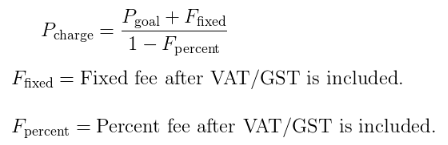

## Passing the Stripe fee on to customers with Laravel Cashier

After working on a client project where I needed to pass Stripe fees on to customers at checkout, I found that this was tricker than I had originally thought and the resources out there to support you are sparse.

Stripe does have a [support article about it](https://support.stripe.com/questions/passing-the-stripe-fee-on-to-customers) but other than a "we don't recommend this", "it might be illegal in your country" and "here is a blury maths expression, good luck"; I wasn't able to learn much from it.

In this repo, I am going to demo how this can be achived using PHP, Laravel and Livewire, but I hope that the logic could easily be reused in other project stacks or languages.

## Run this demo
Set your Stripe keys in the .env file
`composer install`
`php artisan migrate`
`npm i && npm run build`
